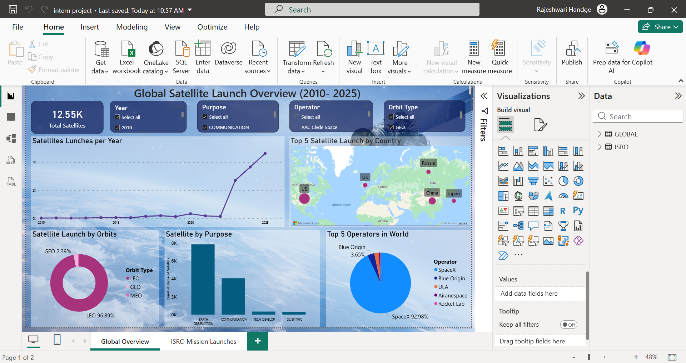
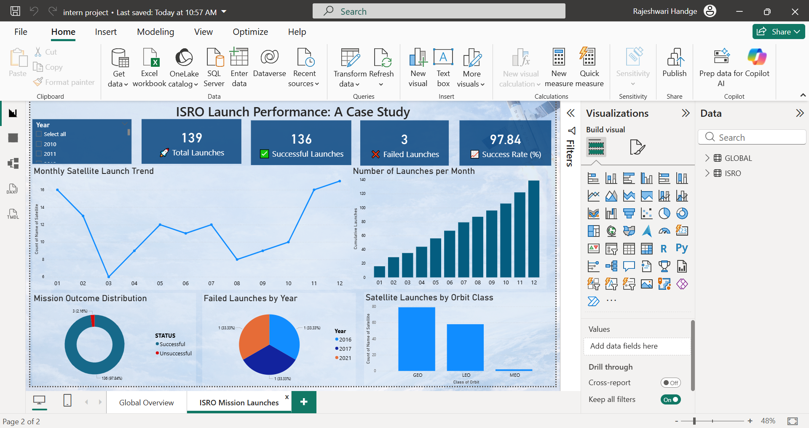

# Satellite Deployment Trend Analysis

## Project Overview

Satellite Deployment Trend Analysis is a data analytics and visualization project developed using Power BI and Microsoft Excel. The project analyzes global satellite deployment trends and ISRO launch performance to identify patterns in satellite launches, mission outcomes, orbital distribution, and launch activities.

Interactive dashboards were created to transform raw data into meaningful insights, enabling effective analysis of satellite deployment growth and space mission performance.

---

## Objectives

- Analyze global satellite deployment trends over time.
- Study the distribution of satellites across different orbit categories.
- Identify major satellite operators and launch activities.
- Evaluate ISRO launch performance and mission success rates.
- Create interactive dashboards for data-driven decision-making.

---

## Tools and Technologies

- Power BI
- Microsoft Excel
- Data Visualization
- Data Cleaning and Preprocessing
- Dashboard Design
- KPI Analysis

---

## Dataset Information

The project uses publicly available satellite launch datasets obtained from Kaggle and processed using Microsoft Excel before visualization in Power BI.

Datasets included:

- Global Satellite Launch Data
- ISRO Launch Data

---

## Dashboard Features

### Global Satellite Deployment Dashboard

- Total Satellite Count Analysis
- Year-wise Launch Trend Analysis
- Satellite Purpose Distribution
- Orbit Category Analysis
- Geographic Launch Insights
- Operator-wise Satellite Distribution

### ISRO Performance Dashboard

- Total Launches KPI
- Successful Launches KPI
- Failed Launches KPI
- Mission Success Rate Analysis
- Monthly Launch Trends
- Mission Outcome Distribution
- Orbit Class Analysis

---

## Key Insights

- Global satellite deployment has increased significantly in recent years.
- Communication satellites account for a major share of total deployments.
- Low Earth Orbit (LEO) remains the most widely used orbit category.
- ISRO maintains a strong mission success rate across launch programs.
- Launch activity trends indicate growing demand for satellite-based services worldwide.

---

## Repository Structure

```
Satellite-Deployment-Trend-Analysis/
│
├── Dashboard/
│   └── Satellite_Launch_Trend_Analysis_Project.pbix
│
├── DataSets/
│   ├── GLOBE.xlsx
│   └── ISRO.xlsx
│
├── Presentation/
│   └── Satellite_Launch_Analysis.pptx
│
├── Screenshots/
│   ├── Dashboard1.png
│   └── Dashboard2.png
│
└── README.md
```

---

## Dashboard Preview

### Global Satellite Deployment Dashboard



### ISRO Performance Dashboard



---

## My Contributions

- Dataset collection and preparation
- Data cleaning and preprocessing
- Dashboard design and development using Power BI
- KPI creation and performance analysis
- Data visualization and insight generation
- Documentation and presentation preparation
- Testing and validation of dashboard outputs

---

## Project Outcome

The project successfully provides a visual and analytical understanding of global satellite deployment trends and ISRO mission performance. The dashboards enable users to explore launch patterns, satellite distribution, and mission success metrics through an interactive and user-friendly interface.

---

## Author

**Rajeshwari Rahul Handge**

BE Computer Engineering

Power BI | Data Analytics | Data Visualization
